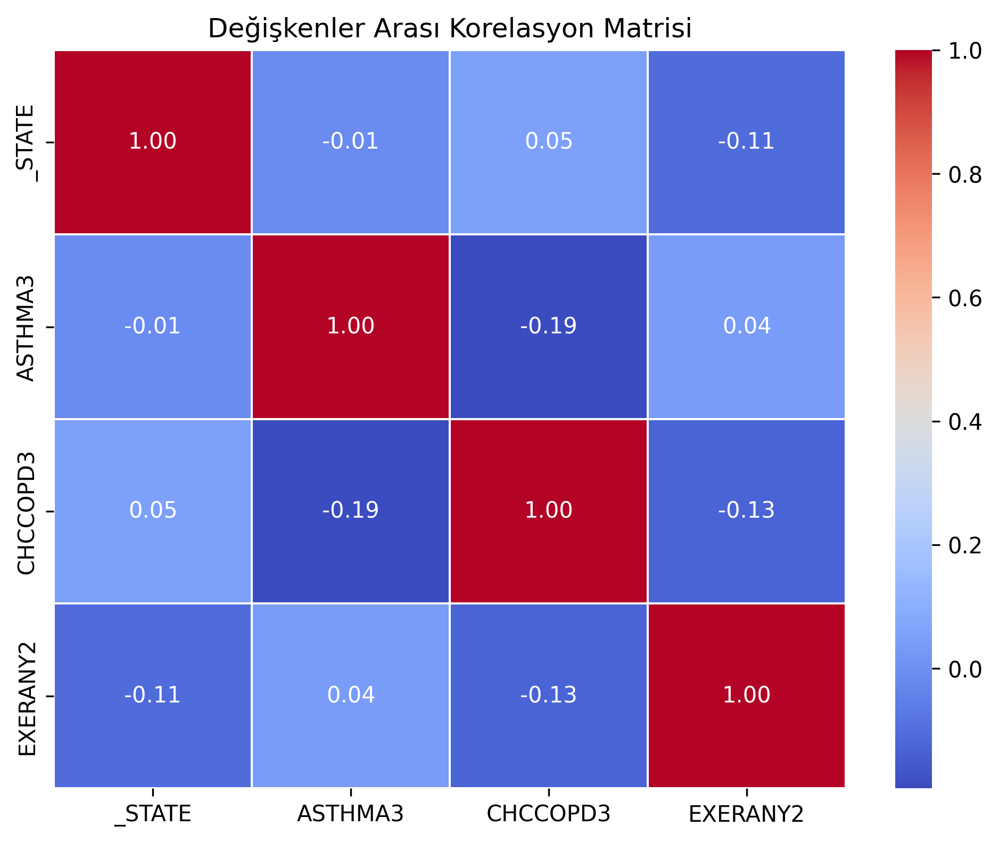
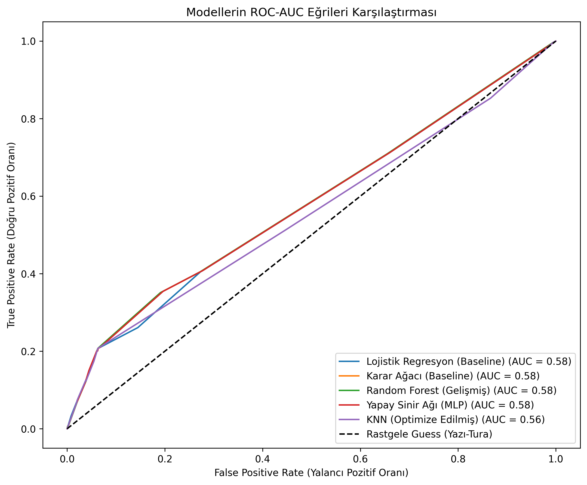

# [cite_start]Makine Öğrenmesi Yöntemleri ile Solunum Yolu Hastalıklarının ve Çevresel Risk Faktörlerinin Çok Boyutlu Analizi [cite: 1]

## 1. Proje Özeti ve Amacı
[cite_start]Bu çalışmada, yetişkin nüfustaki kronik rahatsızlıkları ve davranışsal risk faktörlerini izleyen CDC BRFSS 2024 veri seti kullanılarak solunum yolu hastalıklarının tahmini amaçlanmıştır[cite: 3]. [cite_start]Geleneksel istatistiksel yöntemlerin yetersiz kaldığı bu çok boyutlu veri havuzunda, makine öğrenmesi algoritmaları ile anlamlı tıbbi örüntüler çıkarılması hedeflenmektedir[cite: 15, 16].

## 2. Yöntem ve Veri Ön İşleme
* [cite_start]**Veri Seti:** Araştırmada, 457.670 bireye ait veriden ASTHMA3, _STATE, CHCCOPD3 ve EXERANY2 öznitelikleri izole edilerek 10.000 gözlemden oluşan bir alt örneklem kullanılmıştır[cite: 21, 22].
* [cite_start]**Veri Temizliği:** Katılımcıların geçersiz yanıtları NaN olarak işaretlenmiş ve eksik veriler KNN Imputer (k=5) algoritması ile doldurulmuştur[cite: 29, 30].
* [cite_start]**Ölçeklendirme:** Veri sızmasını (data leakage) engellemek adına %80 Eğitim ve %20 Test ayrımı yapıldıktan sonra Z-Skoru standardizasyonu uygulanmıştır[cite: 33, 34].
* [cite_start]**Model Kurgusu:** GridSearchCV optimizasyonu sonucunda en ideal komşu sayısı k=31 ve ağırlıklandırma stratejisi "distance" olarak belirlenmiştir[cite: 35, 36].

## 3. Keşifsel Veri Analizi (EDA)
[cite_start]Bağımsız değişkenlerin hedef değişken üzerindeki etkisini incelemek için oluşturulan korelasyon matrisi aşağıdadır[cite: 38]. [cite_start]En belirgin ilişki KOAH ile astım arasında (-0.19) gözlemlenirken, eyalet ve fiziksel aktivite verilerinin hedef değişkenle neredeyse sıfıra yakın korelasyon gösterdiği tespit edilmiştir[cite: 40, 41].

## 4. Model Eğitimleri ve Bulgular
[cite_start]Farklı makine öğrenmesi modelleri test verisi üzerinde çalıştırılmış ve elde edilen metrikler kıyaslanmıştır[cite: 42, 43]. 

**Tablo 1: Model Performans Metrikleri**
| Model Adı | Doğruluk (Accuracy) | F1 Skoru (Weighted) | ROC-AUC Skoru | Log Loss | MSE (Hata) |
| :--- | :--- | :--- | :--- | :--- | :--- |
| Lojistik Regresyon (Baseline) | %85,05 | 0,7822 | 0,5513 | 0,4220 | 0,1495 |
| Karar Ağacı (Baseline) | %72,80 | 0,7670 | 0,5115 | 9,8037 | 0,2720 |
| Random Forest (Gelişmiş) | %84,35 | 0,7950 | 0,5330 | 0,5440 | 0,1565 |
| Yapay Sinir Ağı (MLP) | %85,05 | 0,7822 | 0,5467 | 0,4195 | 0,1495 |
| KNN (Optimize Edilmiş) | %84,35 | 0,7962 | 0,5551 | - | 0,1565 |
[cite_start]*(Veriler optimizasyon sonuçlarından alınmıştır)* [cite: 45]

**Modellerin ROC-AUC Karşılaştırması:**

[cite_start]Tüm modellerin ROC-AUC eğrilerinin 0.58 bandında kümelenmesi, sorunun algoritmik bir zayıflıktan çok azınlık sınıfı yetersizliğinden kaynaklandığını doğrulamaktadır[cite: 46, 47].

**Tablo 2: KNN Modeli Konfüzyon Matrisi**.
| Gerçek / Tahmin Durumu | Sınıf 1 (Tahmin: Astım) | Sınıf 0 (Tahmin: Sağlıklı) | Toplam (Support) |
| :--- | :--- | :--- | :--- |
| Sınıf 1 (Gerçek: Astım) | 22 (True Positive) | 277 (False Negative) | 299 |
| Sınıf 0 (Gerçek: Sağlıklı) | 35 (False Positive) | 1666 (True Negative) | 1701 |
[cite_start]*(Matris sonuçları KNN modeline aittir)* [cite: 49]

## 5. Tartışma, Sonuç ve Etik Bildirimler
[cite_start]Modelin yüksek doğruluk (%84,35) oranı istatistiksel bir yanılsamadır; gerçek hastaları sağlıklı olarak etiketlemesi klinik uygulamalarda kabul edilemez bir risk yaratmaktadır[cite: 56, 57]. [cite_start]Geliştirilen model, veri setindeki sınıf dengesizliğinin sonucu olarak çoğunluk sınıfına aşırı uyum (overfitting) göstermiştir[cite: 52, 55].

[cite_start]Sorumlu yapay zeka perspektifinden incelendiğinde, astım hastalarının matematiksel olarak görmezden gelinmesi ciddi bir algoritmik yanlılık (bias) yaratmaktadır[cite: 65, 66]. [cite_start]Ayrıca eyalet değişkeninin sosyoekonomik bir vekil (proxy) olarak çalışma riski ve bölgelerin damgalanma (stigmatization) tehlikesi mevcuttur[cite: 67, 69]. [cite_start]Gelecek çalışmalarda, SMOTE gibi sentetik veri üretme teknikleriyle bu sınıf dengesizliğinin giderilmesi ve daha fazla çevresel özniteliğin modele dahil edilmesi gerekmektedir[cite: 60, 61].